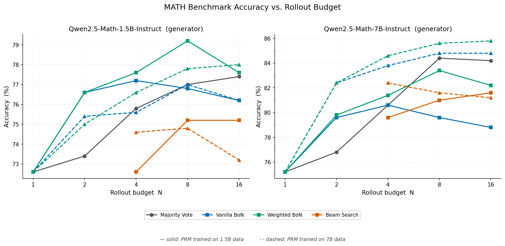
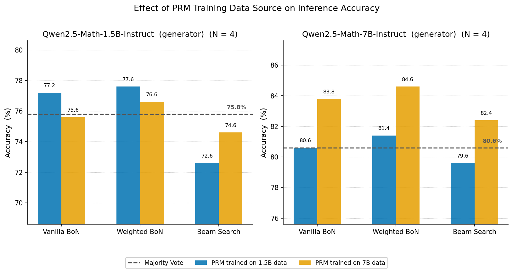

# Test-Time Compute Scaling for Reasoning Fine-Tuned Models

**A systematic study of scaling of inference accuracy on MATH dataset with compute budget and inference strategy**

[](https://www.python.org/)
[](https://pytorch.org/)
[](https://wandb.ai/)
[](LICENSE)

_Process Reward Model training and test-time scaling experiments with_ `Qwen2.5-Math-Instruct` _on the MATH benchmark._

[Overview](#-overview) · [Inference Methods](#-inference-methods) · [PRM](#-process-reward-model) · [Results](#-results) · [Research Questions](#-research-questions) · [Usage](#-usage) · [References](#-references)

---

## 📌 Overview

Recent work has shown that scaling inference compute — rather than or in addition to training compute — can substantially improve the accuracy of language models on reasoning tasks [[1]](#-references)[[2]](#-references). One of the key ingredients of many powerful test-time strategies is a **Process Reward Model (PRM)**: a model that assigns a correctness score to each intermediate reasoning step, enabling search over the space of reasoning traces.

In this project we study the **scaling of accuracy on the [MATH dataset](https://github.com/hendrycks/math) [[8]](#-references) as a function of inference compute** for small open language models, in particular [`Qwen/Qwen2.5-Math-1.5B-Instruct`](https://huggingface.co/Qwen/Qwen2.5-Math-1.5B-Instruct) and [`Qwen/Qwen2.5-Math-7B-Instruct`](https://huggingface.co/Qwen/Qwen2.5-Math-7B-Instruct) [[9]](#-references). We compare four inference strategies at varying rollout budgets $N$:

| Method | PRM Required | Aggregation Level |
|---|---|---|
| **Majority Vote** | No | Answer |
| **Vanilla Best-of-N** | Yes | Trace (last-step score) |
| **Weighted Best-of-N** | Yes | Answer (sum of last-step scores) |
| **PRM-Guided Beam Search** | Yes | Trace (step-level pruning) |

We train two PRM variants with identical architecture (Qwen2.5-Math-1.5B-Instruct as base model and a binary classification head) on training data generated from different models to disentangle the effect of training data distribution:

| PRM Checkpoint | Base Model | Training Data Generator |
|---|---|---|
| `PRM_1.5B_Train` | Qwen2.5-Math-1.5B-Instruct | Qwen2.5-Math-1.5B-Instruct |
| `PRM_1p5B_7B_Train` | Qwen2.5-Math-1.5B-Instruct | Qwen2.5-Math-7B-Instruct |

This setup lets us as the following questions:

**Which inference method provides the best accuracy at a given test-time compute budget?**

**Does training data from a larger more powerful model improve PRM performance?**

**Does a smaller PRM trained on data from a larger model offer a cheaper path to improving inference for that larger model?**

*Note that the first question was already studied in [[1]](#-references).*

---

## 🔬 Inference Methods

### Majority Vote (Self-Consistency)

For each problem, $N$ independent reasoning traces are sampled from the generator LLM. The final answer $\hat{a}$ is determined by plurality vote over the normalized extracted answers (grader and math normalizer are taken from [here](https://github.com/openai/prm800k/blob/main/prm800k/grading/)) [[3]](#-references):

$$\hat{a} = \underset{a}{\arg\max} \sum_{i=1}^{N} \mathbb{1}[\text{normalize}(a_i) = a]$$

No reward model is required. This is the baseline against which PRM-based methods are compared.

### Vanilla Best-of-N

Each of the $N$ rollouts is scored by the PRM, which assigns a probability $p_s \in [0,1]$ to each reasoning step $s$. The rollout with the highest **last-step PRM score** is selected as the answer:

$$\hat{a} = a_{i^{\star}}, \quad i^{\star} = \underset{i}{\arg\max}\; p^{(i)}_{\text{last}}$$

This uses the PRM as a verifier but discards answer-level diversity.

### Weighted Best-of-N

Instead of selecting a single best rollout, we **aggregated** the last step answer scores across all rollouts with the same normalised answer. This combines the diversity benefit of majority vote with the discriminative power of the PRM [[1]](#-references):

$$\hat{a} = \underset{a}{\arg\max} \sum_{\{i\,:\,a_i = a\}} p^{(i)}_{\text{last}}$$

### PRM-Guided Beam Search

Rather than scoring complete rollouts post-hoc, beam search uses the PRM to **guide the search tree at each reasoning step** [[2]](#-references). Given a budget of $N$ total step expansions per depth and $M$ proposals per beam:

- Maintain $B = N / M$ active beams
- At each depth: each beam proposes $M$ next-step continuations via the LLM ($N$ candidates total)
- The PRM scores each candidate and only the top $B$ beams survive to the next depth
- Generation halts when a beam produces a `\boxed{}` expression or `max_steps` is reached

This explores a directed tree of reasoning paths and focuses compute on promising prefixes. However, it relies on high-quality training data for the PRM at intermediate steps.

---

## 🏋️ Process Reward Model

### Architecture

The PRM is built on top of a [`Qwen2.5-Math-1.5B-Instruct`](https://huggingface.co/Qwen/Qwen2.5-Math-1.5B-Instruct) backbone with a single linear classification head of dimension 1 appended to the last hidden layer. Due to the relatively small base model, we train both the base model weights and the head.

Given a tokenised sequence of a prompt followed by $K$ reasoning steps separated by a special step separator token `\n<step>\n`, the PRM predicts a **step-level binary label** at the position of each separator token:

$$p_k = \sigma\!\left(W \cdot h_{\text{sep}_k}\right), \quad k = 1,\ldots,K$$

where $h_{\text{sep}_k}$ is the hidden state at the $k$-th separator position and $W$ is the learned head. Training uses binary cross-entropy loss on these positions only; all other token positions are masked. We 

### Training Data Generation

PRM training data is generated via **Monte Carlo (MC) rollout estimation** on a random 1000-sample subset of the MATH training set, saved in ``data/PRM_Train/data_selection.json``. The procedure follows [[4]](#-references)[[5]](#-references):

**Step 1 — Rollout generation:** For each problem, $G = 8$ full reasoning traces are sampled from the generator LLM using vLLM.

**Step 2 — Step-level MC evaluation:** For each step $k$ in each trace, $G_\text{MC} = 8$ continuations are sampled from that step onwards. A step is labelled **positive** ($y_k = 1$) if at least one continuation leads to a correct final answer, and **negative** ($y_k = 0$) otherwise.

This produces a dataset of (prompt, steps, step-labels) triples that approximate the **per-step outcome probability** under the generator policy — the quantity the PRM is trained to predict. The dataset in ``data/PRM_Train/1.5B/PRM_1p5B_data.jsonl`` and ``data/PRM_Train/7B/PRM_7B_data.jsonl`` contains more information. As labels for each step, we saved the ratio of correct completions over the number of all completions, so that the data can also be used for regression where the values represent a MC estimate of the correctness probability.

We generate two datasets with different generator LLMs, yielding the two PRM checkpoints described in the [Overview](#-overview).

### Training Details

| Hyperparameter | Value |
|---|---|
| Base model | `Qwen2.5-Math-1.5B-Instruct` |
| Learning rate | `2e-5` |
| Batch size | 1 + gradient accumulation 16 |
| Epochs | 3 |
| Warmup ratio | 0.1 |
| Max token length | 2048 |
| Optimizer | AdamW |
| Precision | bfloat16 |

---

## 📊 Results

### Accuracy vs. Rollout Budget

The plots below show the test accuracy on the MATH benchmark as a function of the number of rollouts $N$ for all four inference methods and both PRM variants and both generator models

<div align="center">
<!-- TODO: insert accuracy-vs-rollouts plot -->

</div>

Interestingly, beam search performs poorly in both cases. The reason for that might be a combination of a lack of diversity paired with a poor quality of intermediate step predictions of the PRM. An explanation for this might be that the PRM training data relies on MC, where also wrong intermediate steps can lead to the correct result. Such wrong intermediate states would, however, be considered desireable by the PRM. It would be interesting to see if a higher quality dataset with human annotations would improve the performance of the PRM on intermediate steps and thus the accuracy of the beam search.

Best-of-N, both the vanilla and the weighted version, generally yield the best performance. This shows that the PRM is particularly good at predicting the correctness of the last step, the result of the reasoning process.

The best accuracy across all experiments is **85.8%**, achieved by Weighted Best-of-N with the PRM trained on 7B-generated data at N=16 rollouts (7B generator). This corresponds to a **+10.6 percentage point** improvement over the zero-shot (N=1) baseline of **75.2%** for the same model.

### PRM Data Source: 1.5B- vs. 7B-Generated Training Data

Let us now study the dependence on the source of the PRM training data and let us take $N=4$ as an example.

<div align="center">
<!-- TODO: insert 1.5B vs 7B PRM comparison plot -->

</div>

In both cases it is clearly visible that the PRM which was trained on in-distribution data, i.e. the PRM training data was generated by the same generator that also performs the inference, has a significantly better performance than the PRM trained on out-of-distribution data.

It is also interesting that even for the larger 7B model, a smaller PRM based on the 1.5B model, but trained on 7B data, significantly boosts the performance. A next step would be to compare this to a PRM based on the larger 7B model architecture to assess how much performance gain, if any, can be achieved with a larger base model for the PRM.


### Summary Table

Results at $N = 4$ rollouts on the MATH test set:

| Method | PRM | 1.5B Generator | 7B Generator |
|---|---|---|---|
| Majority Vote | — | 75.8% | 80.6% |
| Vanilla Best-of-N | PRM (1.5B data) | 77.2% | 80.6% |
| Weighted Best-of-N | PRM (1.5B data) | **77.6%** | 81.4% |
| Beam Search | PRM (1.5B data) | 72.6% | 79.6% |
| Vanilla Best-of-N | PRM (7B data) | 75.6% | 83.8% |
| Weighted Best-of-N | PRM (7B data) | 76.6% | **84.6%** |
| Beam Search | PRM (7B data) | 74.6% | 82.4% |

---

## ❓ Research Questions

Now we are in a position to answer the three questions that we started out with:

**i) hich inference method provides the best accuracy at a given test-time compute budget?**

We found that the weighted best-of-N method generally performs the best, especially for relatively small test-time compute. Once the test-time compute is enhanced, majority vote catches up due to the sheer diversity of reasoning traces. Thus, at lower test-time compute a PRM (or ORM) is beneficial to increase the model accuracy. Note, however, that we already started with a highly specialized Math and instruction fine-tuned model. The gain would likely be bigger for a base model.

**ii) Does training data from a larger, more powerful model improve PRM performance?**

No! The out-of-distribution penalty is too large. It is more beneficial to use training data for the PRM which is drawn from the same distribution as the test-time data, since this is what it has to classify.

**iii) Does a smaller PRM trained on data from a larger model offer a cheaper path to improving inference for that larger model?**

Yes! As can be clearly seen in the above figure, a smaller PRM model trained on data from the larger language model can significantly boost the accuracy, especially at small compute. Such a PRM is computationally much cheaper to operate than a larger PRM. And additionally, for a fixed accuracy the use of a small PRM on fewer rollouts for best-of-N inference beats majority vote for a larger number of rollouts, making best-of-N computationally cheaper.

---

## ⚙️ Installation

Dependencies are managed with [uv](https://docs.astral.sh/uv/). Install it first if you don't have it:

```bash
curl -LsSf https://astral.sh/uv/install.sh | sh
```

Then clone the repo and let uv create the virtual environment and install all dependencies in one step:

```bash
git clone https://github.com/maxruhdorfer/Test-Time-Compute-For-Reasoning-Fine-Tuned-Models.git
cd Test-Time-Compute-For-Reasoning-Fine-Tuned-Models

uv sync
```

Prefix any script invocation with `uv run` to use the managed environment (see [Usage](#-usage) below), or activate the environment manually:

```bash
source .venv/bin/activate
```

> **Hardware note:** Experiments were run on a single A100 80GB GPU. Reduce `--gpu_memory_utilization` for smaller GPUs.

---

## 🚀 Usage

All scripts are run via `uv run`. Alternatively, activate the virtual environment first (`source .venv/bin/activate`) and call `python` directly.

### Generate PRM Training Data

```bash
uv run generate_PRM_data.py \
    --model 1-5-B \
    --train_dataset data/PRM_Train/data_selection.json \
    --train_samples 1000 \
    --rollouts 8 \
    --rollouts_MC 8 \
    --output data/PRM_Train/1.5B/PRM_1p5B_data.jsonl
```

#### Key Arguments

| Argument | Default | Description |
|---|---|---|
| `--model` | `7-B` | Generator LLM — `1-5-B` (Qwen2.5-Math-1.5B-Instruct) or `7-B` (Qwen2.5-Math-7B-Instruct) |
| `--train_dataset` | `data/PRM_Train/data_selection.json` | Pre-selected problem subset (JSON array) to generate rollouts for |
| `--train_samples` | `1000` | Number of problems sampled from the dataset |
| `--rollouts` | `8` | Full rollouts generated per problem ($G$) |
| `--rollouts_MC` | `8` | MC continuations sampled per step ($G_\text{MC}$) |
| `--max_tokens` | `2048` | Maximum tokens per rollout |
| `--sampling_temperature` | `1.0` | Sampling temperature |
| `--top_p` | `1.0` | Top-p (nucleus) sampling parameter |
| `--prompt_path` | `prompts/CoT.prompt` | Path to the prompt template file |
| `--output` | `data/PRM_Train/7B/PRM_7B_data.jsonl` | Output path for the generated dataset |

### Train a PRM

```bash
uv run train_PRM.py \
    --model_id Qwen/Qwen2.5-Math-1.5B-Instruct \
    --train_data_path data/PRM_Train/1.5B/PRM_data.jsonl \
    --epochs 3 \
    --lr 2e-5 \
    --gradient_accumulation_steps 16 \
    --run_name my_prm_run
```

A W&B sweep over PRM hyperparameters can be launched with:

```bash
bash sweep_PRM.sh
```

#### Key Arguments

| Argument | Default | Description |
|---|---|---|
| `--model_id` | `Qwen/Qwen2.5-Math-1.5B-Instruct` | Base model for the PRM |
| `--train_data_path` | `data/PRM_Train/7B/PRM_7B_data.jsonl` | Path to generated PRM training data |
| `--run_name` | `PRM_1p5B_7B_Train` | W&B run name and checkpoint directory name |
| `--epochs` | `3` | Training epochs |
| `--lr` | `2e-5` | AdamW learning rate |
| `--gradient_accumulation_steps` | `16` | Gradient accumulation steps |
| `--batch_size` | `1` | Per-step batch size |
| `--max_tokens` | `2048` | Maximum token length |
| `--val_fraction` | `0.1` | Fraction of data held out for validation |
| `--val_interval` | `500` | Validation frequency (optimizer steps) |
| `--warmup_ratio` | `0.1` | Linear warmup fraction of total steps |
| `--seed` | `41` | Random seed |
| `--checkpoint_dir` | `checkpoints` | Directory to save model checkpoints |
| `--no_checkpoint` | `False` | Disable checkpoint saving |
| `--use_wandb` | `False` | Enable Weights & Biases logging |
| `--output` | `logs/1.5B_model_7B_train.log` | Path to save training statistics (JSON) |

### Run Benchmark

```bash
uv run benchmark.py \
    --model 1-5-B \
    --test_dataset data/MATH/test.jsonl \
    --prm_path_15 checkpoints/PRM_1.5B_Train \
    --prm_path_7 checkpoints/PRM_1p5B_7B_Train \
    --rollouts 8 \
    --beam_M 4
```

A convenience wrapper that runs the benchmark over multiple rollout counts is available:

```bash
bash run_benchmark.sh
```

#### Key Arguments

| Argument | Default | Description |
|---|---|---|
| `--model` | `1-5-B` | Generator LLM — `1-5-B` (Qwen2.5-Math-1.5B-Instruct) or `7-B` (Qwen2.5-Math-7B-Instruct) |
| `--test_dataset` | `data/MATH/test.jsonl` | Path to MATH test set |
| `--prm_path_15` | `checkpoints/PRM_1.5B_Train` | PRM trained on 1.5B-generated data |
| `--prm_path_7` | `checkpoints/PRM_1p5B_7B_Train` | PRM trained on 7B-generated data |
| `--rollouts` | `8` | Number of rollouts $N$ per problem |
| `--beam_M` | `4` | Step proposals per beam in beam search |
| `--sampling_temperature` | `0.7` | Sampling temperature for generation |
| `--top_p` | `1.0` | Top-p (nucleus) sampling parameter |
| `--max_tokens` | `2048` | Maximum tokens per rollout |
| `--prompt_path` | `prompts/CoT.prompt` | Path to the prompt template file |
| `--output_path` | `logs/benchmark/7B/` | Directory to save benchmark result JSONs |

---

## 🗂️ Repository Structure

```
.
├── pyproject.toml            # Project metadata and dependencies (managed by uv)
├── uv.lock                   # Locked dependency versions
├── benchmark.py              # Evaluate all inference methods on MATH test set
├── inference.py              # Majority vote, best-of-N variants, beam search
├── train_PRM.py              # PRM training loop
├── generate_PRM_data.py      # MC rollout data generation for PRM training
├── PRM_model.py              # PRM model definition (LM backbone + linear head)
├── Qwen-zeroShot.py          # Zero-shot baseline evaluation
├── run_benchmark.sh          # Shell wrapper to run benchmark over rollout counts
├── sweep_PRM.sh              # W&B hyperparameter sweep launcher for PRM training
├── plots.ipynb               # Result visualisation notebook
├── prompts/
│   ├── CoT.prompt            # Chain-of-thought prompt template (chat format)
│   └── CoT_no_chat.prompt    # Chain-of-thought prompt template (raw format)
├── grading/
│   ├── grader.py             # SymPy-based answer grader
│   └── math_normalize.py     # LaTeX / answer normalisation utilities
├── Figs/                     # Generated result figures
├── checkpoints/
│   ├── PRM_1.5B_Train/       # PRM trained on 1.5B-generated data
│   └── PRM_1p5B_7B_Train/    # PRM (1.5B base) trained on 7B-generated data
├── data/
│   ├── MATH/                 # MATH train / test splits
│   └── PRM_Train/            # Generated PRM training datasets
└── logs/
    ├── benchmark/            # Benchmark results per rollout count
    └── sweep/                # PRM hyperparameter sweep results
```

---

## 📚 References

[1] Snell et al. *Scaling LLM Test-Time Compute Optimally Can be More Effective than Scaling Model Parameters.* 2024. https://arxiv.org/abs/2408.03314

[2] Lightman et al. *Let's Verify Step by Step.* ICLR 2024. https://arxiv.org/abs/2305.20050

[3] Wang et al. *Self-Consistency Improves Chain of Thought Reasoning in Language Models.* ICLR 2023. https://arxiv.org/abs/2203.11171

[4] Luo et al. *Improve Mathematical Reasoning in Language Models by Automated Process Supervision.* 2024. https://arxiv.org/abs/2406.06592

[5] Wang et al. *Math-Shepherd: Verify and Reinforce LLMs Step-by-step without Human Annotations.* ACL 2024. https://arxiv.org/abs/2312.08935

[6] Guo et al. *DeepSeek-R1: Incentivizing Reasoning Capability in LLMs via Reinforcement Learning.* 2025. https://arxiv.org/abs/2501.12948

[7] Brown et al. *Large Language Monkeys: Scaling Inference Compute with Repeated Sampling.* 2024. https://arxiv.org/abs/2407.21787

[8] Hendrycks et al. *Measuring Mathematical Problem Solving With the MATH Dataset.* NeurIPS 2021. https://arxiv.org/abs/2103.03874

[9] Qwen Team. *Qwen2.5-Math Technical Report.* 2024. https://arxiv.org/abs/2412.15115

---

<sub>MIT License · Built with PyTorch & vLLM</sub>
